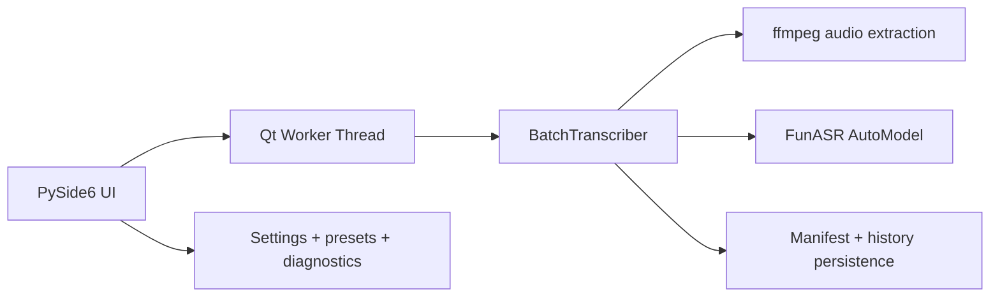

# Architecture

## Overview

FunASR Batch Studio is designed around a small core and a thin Qt UI shell.

## Layers

### GUI

- `gui/main_window.py`
- owns user interaction, validation, table updates, history loading, and diagnostics refresh

### Worker bridge

- `core/worker.py`
- connects the long-running transcription pipeline to Qt signals

### Runtime pipeline

- `core/transcriber.py`
- extracts audio when required
- runs FunASR
- writes outputs
- updates manifest after each state change

### State and persistence

- `core/models.py`
- `core/storage.py`
- JSON-based persistence for:
  - app settings
  - manifests
  - vocabulary presets
  - recent manifests

### Environment services

- `core/paths.py`
- `core/diagnostics.py`
- portable state directory resolution and dependency checks

## Design choices

### Why JSON manifests

- easy to inspect manually
- easy to migrate
- resilient enough for local desktop workflows

### Why sequential processing in alpha

- simpler resume behavior
- easier logs and diagnosis
- fewer concurrency surprises around ffmpeg, model loading, and GPU memory

### Why pause means "after current file"

- safer runtime behavior
- avoids half-written outputs and ambiguous model state

